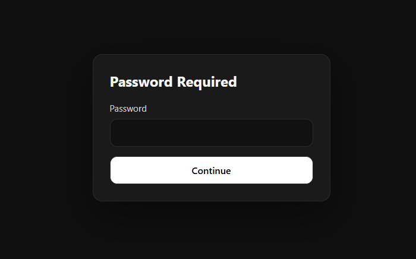

# hodor

A tiny reverse proxy that holds the door — put it in front of any app to gate access behind a single shared password. No users, no database, no OAuth. Just one password and a login page.

## Features

- Single shared password — no user accounts, no database
- Clean dark-themed login page (or bring your own with Jinja2 templates)
- Runs as a Docker sidecar in front of any web app
- HMAC-SHA256 signed session cookies
- Streaming reverse proxy (handles large uploads/downloads without buffering)
- Constant-time password comparison
- Brute-force protection: per-IP rate limiting (5 attempts / 60s), escalating lockouts after repeated failures, and delayed responses to failed logins
- Structured tracing output (compact or JSON)
- Health check endpoint for container orchestrators
- Graceful shutdown on SIGTERM
- Layered config: defaults → `hodor.toml` → environment variables
- Built with Rust, runs from a `scratch` image (~5MB)

## Quick Start

```yaml
# docker-compose.yml
services:
  gate:
    image: ghcr.io/michidk/hodor:latest
    ports:
      - "8080:8080"
    environment:
      PASSWORD: "changeme"                          # the login password
      UPSTREAM: "http://app:80"
      SECRET: "changeme"                              # signs session cookies (generate with: openssl rand -hex 32)
    depends_on:
      - app

  app:
    image: traefik/whoami
```

```sh
docker compose up
```

Open `http://localhost:8080` — you'll see the login page. Enter the password, and you're proxied through to the app.



## Configuration

Hodor uses layered configuration. Each layer overrides the previous:

1. **Defaults** — sensible built-in values
2. **`hodor.toml`** — optional config file in the working directory
3. **Environment variables** — override everything (uppercase, e.g. `PASSWORD`)

### Options

| Key | Env var | Required | Default | Description |
| --- | --- | --- | --- | --- |
| `password` | `PASSWORD` | yes | | The shared password |
| `upstream` | `UPSTREAM` | yes | | Backend URL to proxy to (e.g. `http://app:3000`) |
| `secret` | `SECRET` | no | random | Cookie signing key. Set this to persist sessions across restarts |
| `listen` | `LISTEN` | no | `:8080` | Listen address |
| `title` | `TITLE` | no | `Password Required` | Login page heading |
| `custom_css` | `CUSTOM_CSS` | no | | Extra CSS injected after the built-in styles on the login and error pages |
| `disable_default_css` | `DISABLE_DEFAULT_CSS` | no | `false` | Set `true` to drop the built-in styles entirely (style from scratch with `custom_css`) |
| `template` | `TEMPLATE` | no | built-in | Path to a custom HTML login page template |
| `error_template` | `ERROR_TEMPLATE` | no | built-in | Path to a custom HTML error page template |
| `session_ttl` | `SESSION_TTL` | no | `86400` | Session duration in seconds (default: 24h) |
| `secure_cookie` | `SECURE_COOKIE` | no | `false` | Set `true` to add the `Secure` flag to cookies (requires HTTPS) |
| `log_format` | `LOG_FORMAT` | no | `compact` | Tracing output format: `compact` or `json` |
| — | `RUST_LOG` | no | `info` | Log level filter (e.g. `debug`, `hodor=trace`) |

### Config File Example

```toml
# hodor.toml
password = "changeme"
upstream = "http://app:3000"
secret = "changeme" # generate with: openssl rand -hex 32
title = "Restricted Area"
session_ttl = 3600
secure_cookie = true
```

Environment variables always win. Set `PASSWORD=override` and it takes precedence over `password` in the TOML file.

## How It Works

```
Request → hodor
  ├─ /_gate/health → 200 ok (bypass auth)
  ├─ Has valid session cookie? → Reverse proxy to UPSTREAM
  └─ No cookie? → Show login page
       └─ POST /_gate/login
            ├─ Rate limited or locked out? → 429 (with Retry-After)
            ├─ Password correct? → Set cookie, redirect back
            └─ Wrong? → Show login page with error (after a short delay)
```

### Brute-Force Protection

Login attempts are guarded per client IP, entirely in memory:

- **Rate limiting** — at most 5 attempts per 60 seconds per IP.
- **Escalating lockouts** — after 10 consecutive failed attempts, the IP is locked out for 60 seconds; each further failure doubles the lockout, up to 1 hour.
- **Failure delay** — every failed attempt is answered after a 500ms delay to slow down online guessing.
- **`Retry-After`** — rate-limited and locked-out responses return `429` with a `Retry-After` header.

A successful login clears the IP's failure history. State is in-memory (capped at 10,000 tracked IPs), so it resets on restart.

Note: hodor uses the TCP peer address as the client IP. If you run hodor behind another reverse proxy, all clients share that proxy's IP for rate-limiting purposes.

### Reserved Paths

- `/_gate/login` — login form submission (POST) / redirect to gate (GET)
- `/_gate/logout` — clears session cookie
- `/_gate/health` — returns `ok` (for liveness/readiness probes)

All other paths are proxied to the upstream.

### Proxy Behavior

- Streams request and response bodies without buffering (safe for large files)
- Sets `X-Forwarded-For` and `X-Forwarded-Proto` headers on proxied requests
- Strips hop-by-hop headers (Connection, Transfer-Encoding, etc.)
- Forwards the upstream's `Host` header
- WebSocket proxying is not yet supported (returns 501)

## Custom CSS

To restyle the built-in login and error pages without maintaining a full template, set `custom_css`. It is injected into a `<style>` tag after the built-in styles, so your rules take precedence:

```yaml
environment:
  CUSTOM_CSS: |
    body { background: #1e3a5f; }
    .card { border-radius: 4px; }
    button { background: #ffb703; color: #000; }
```

The CSS is emitted verbatim (not escaped), so anything valid in a `<style>` block works.

To start from a blank slate instead of overriding the dark theme, set `disable_default_css` — the built-in styles are dropped entirely and only your CSS applies:

```yaml
environment:
  DISABLE_DEFAULT_CSS: "true"
  CUSTOM_CSS: |
    body { font-family: system-ui; display: grid; place-items: center; min-height: 100vh; }
    .card { max-width: 400px; padding: 32px; border: 1px solid #ddd; border-radius: 12px; }
```

The built-in markup keeps the same structure and class names (`.card`, `.error`, `.actions`), so your stylesheet can target them directly. For different markup entirely, use a custom template instead (below).

## Custom Login Page

Hodor ships with a built-in dark-themed login page. To use your own login page, set `template` to the path of an HTML file:

```yaml
environment:
  TEMPLATE: /etc/hodor/login.html
volumes:
  - ./my-login.html:/etc/hodor/login.html:ro
```

Templates use [Jinja2 syntax](https://jinja.palletsprojects.com/) (via [minijinja](https://github.com/mitsuhiko/minijinja)). The following variables are available:

| Variable | Type | Description |
| --- | --- | --- |
| `title` | string | The configured title (auto-escaped) |
| `show_error` | bool | `true` when the user entered a wrong password |
| `custom_css` | string | The configured `custom_css` — include it with `{{ custom_css \| safe }}` to keep the override working in your template |
| `disable_default_css` | bool | `true` when `disable_default_css` is set — custom templates can use it to gate their own base styles |

### Template Example

The built-in template ([`src/template.html`](src/template.html)) is a good starting point for custom designs. Here's a minimal example showing the required structure:

```html
<!DOCTYPE html>
<html lang="en">
<head>
  <meta charset="utf-8">
  <meta name="viewport" content="width=device-width, initial-scale=1">
  <title>{{ title }}</title>
  <style>
    * { box-sizing: border-box; margin: 0; }
    body {
      min-height: 100vh;
      display: grid;
      place-items: center;
      padding: 24px;
      font-family: system-ui, sans-serif;
      background: #f5f5f5;
    }
    .card {
      width: 100%;
      max-width: 380px;
      background: #fff;
      border-radius: 12px;
      padding: 32px;
      box-shadow: 0 4px 24px rgba(0, 0, 0, 0.1);
    }
    h1 { margin-bottom: 20px; font-size: 1.4rem; }
    input, button {
      width: 100%;
      padding: 10px 14px;
      border: 1px solid #ddd;
      border-radius: 8px;
      font: inherit;
    }
    input { margin-bottom: 12px; }
    button { background: #111; color: #fff; border: none; cursor: pointer; }
    .error {
      display: blocknone;
      margin-bottom: 12px;
      padding: 10px;
      border-radius: 8px;
      background: #fef2f2;
      color: #dc2626;
    }
  </style>
</head>
<body>
  <main class="card">
    <h1>{{ title }}</h1>
    <div class="error">Wrong password.</div>
    <form method="post" action="/_gate/login">
      <input type="hidden" name="redirect" value="/">
      <input name="password" type="password" placeholder="Password" autocomplete="current-password" autofocus required>
      <button type="submit">Continue</button>
    </form>
  </main>
  <script>
    const redirect = document.querySelector('input[name="redirect"]');
    if (redirect) redirect.value = window.location.pathname + window.location.search + window.location.hash || '/';
  </script>
</body>
</html>
```

### Template Requirements

1. The form **must** POST to `/_gate/login` with a `password` field
2. Include a `redirect` hidden field (populated via JS) so users return to the page they were trying to access
3. Use `` to conditionally show error messages

## Custom Error Page

Hodor also ships with a built-in styled error page for upstream failures and unsupported WebSocket upgrades. To customize it, set `error_template` to the path of an HTML file:

```yaml
environment:
  ERROR_TEMPLATE: /etc/hodor/error.html
volumes:
  - ./my-error.html:/etc/hodor/error.html:ro
```

The built-in error template ([`src/error_template.html`](src/error_template.html)) receives these variables:

| Variable | Type | Description |
| --- | --- | --- |
| `title` | string | The configured title (auto-escaped) |
| `status_code` | number | HTTP status code such as `502` or `501` |
| `heading` | string | Short error heading |
| `message` | string | Human-readable error message |
| `custom_css` | string | The configured `custom_css` — include it with `{{ custom_css \| safe }}` to keep the override working in your template |
| `disable_default_css` | bool | `true` when `disable_default_css` is set — custom templates can use it to gate their own base styles |

## Building from Source

```sh
cargo build --release
```

```sh
PASSWORD=secret UPSTREAM=http://localhost:3000 ./target/release/hodor
```

## Docker

Build locally:

```sh
docker build -t hodor .
docker run -e PASSWORD=secret -e UPSTREAM=http://host.docker.internal:3000 -p 8080:8080 hodor
```

### Health Checks

Hodor exposes `/_gate/health` which returns `200 ok` — use it for liveness and readiness probes.

Since hodor runs from a `scratch` image, there's no shell or utilities inside the container. Use an external probe or your orchestrator's native HTTP health check:

```yaml
# Kubernetes
livenessProbe:
  httpGet:
    path: /_gate/health
    port: 8080
  initialDelaySeconds: 2
  periodSeconds: 10
```

## License

[MIT](LICENSE)
